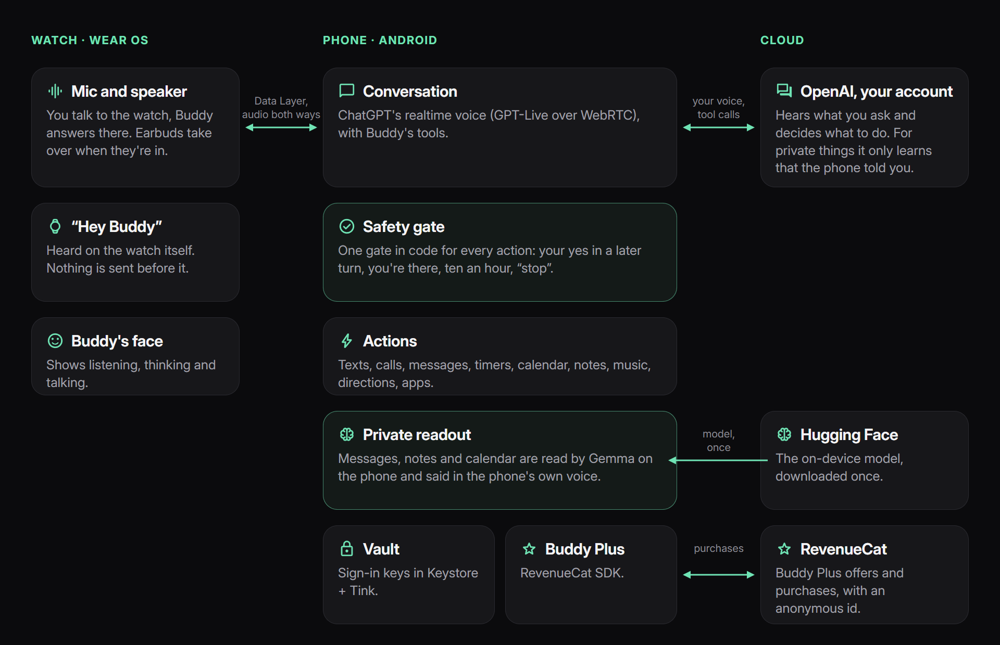

# Buddy

[](https://github.com/thenguyentrong/watch-ai/actions/workflows/ci.yml)
[](LICENSE)


**Buddy** is a private, hands-free AI agent on the smartwatch you already wear. It acts on your phone
(texts, calls, messages, timers, calendar), runs on the ChatGPT plan you already pay for, and reads
what's private with on-device AI, on the phone.

This repository has the Wear OS watch app, the Android phone app and everything between them. Made for
the RevenueCat Shipaton 2026: the story is in [docs/shipaton.md](docs/shipaton.md), and the beta
waitlist is at [heybuddy-watch.vercel.app](https://heybuddy-watch.vercel.app).

---

## Guide

1. **📖 Understand Buddy**
   - Read the [Overview](docs/overview.md) for what Buddy does and why.
   - See [How it works](docs/architecture.md) for the watch, the phone and what goes to the cloud.
   - Read [Agent safety](docs/security/agent-safety.md) and the [privacy policy](PRIVACY.md).

2. **🔧 Set up**
   - Follow [Getting started](docs/getting-started.md) to build Buddy and install it on your phone and
     watch.
   - Optional: add a RevenueCat Test Store key for [Buddy Plus](docs/getting-started.md#2-optional-buddy-plus).

3. **💻 Build on it**
   - Find your way around with the [repository structure](#repository-structure) and the
     [key modules](#key-modules).
   - Read the [decisions](docs/adr/) behind the big choices.

4. **🧪 Test**
   - Run the checks in [Testing](docs/testing.md). Test data is synthetic only.
   - In the app, try a tricky message under **Settings → See what ChatGPT gets**.
   - See [Troubleshooting](docs/troubleshooting.md) if something doesn't work.

5. **🚀 Try Buddy**
   - Join the [beta waitlist](https://heybuddy-watch.vercel.app).

---

## How it works



Buddy is split into **three parts**:

### 1. The watch (`wear`)

The microphone, the speaker and Buddy's face. **"Hey Buddy"** is heard on the watch itself, and audio
goes to the phone and back over a Wear Data Layer channel. With earbuds in, they take over the sound.

**What it sends:** your voice, after "Hey Buddy" or a tap. **What it gets:** Buddy's voice and face.

### 2. The phone (`app`)

Runs the conversation on ChatGPT's realtime voice, under your own account, and does the actions:
texts, calls, messages, timers, calendar, notes, music, directions and more. Every action goes through
**one safety gate written in code**, and what's private is read by **Gemma on the phone**.

**What leaves the phone:** what you say, and the tool calls ChatGPT makes. **What stays:** your
messages, notes, calendar and sign-in keys.

### 3. The cloud

**OpenAI**, under your own ChatGPT account, hears your requests and decides what to do. **RevenueCat**
runs Buddy Plus. **Hugging Face** hosts the on-device model, downloaded once. There are no servers of
mine.

> [!IMPORTANT]
> **Private things stay on the phone.** When ChatGPT asks for your messages, notes or calendar, the
> phone reads them with Gemma and says the answer in its own voice. ChatGPT only learns that the phone
> told you, and its microphone hears silence meanwhile. Details in
> [How it works](docs/architecture.md#private-readout).

---

## Repository structure

```
watch-ai/
├── app/                  # Phone app: Buddy, conversations, actions, the safety gate, Buddy Plus
├── wear/                 # Watch app: Buddy's face, "Hey Buddy", Learn my voice
├── core/
│   ├── brain/            # Brain interface, tools, the safety gate and the cleaner (guard)
│   ├── brain-chatgpt/    # Sign in with ChatGPT, token refresh, Responses streaming
│   ├── brain-ondevice/   # Gemma via LiteRT-LM, verified model download
│   ├── buddy/            # Buddy's shapes, faces and moods (ported from bloub)
│   ├── buddy-ui/         # Drawing Buddy
│   ├── security/         # Keystore + Tink vault, log redaction, screen protection
│   ├── testing/          # Fakes and synthetic test data
│   ├── voice/            # ChatGPT voice over WebRTC, the phone's own voice
│   └── watchlink/        # The watch-phone audio link: frames, ADPCM, jitter buffers
├── docs/                 # Documentation
└── gradle/               # Version catalog, dependency verification
```

---

## Key modules

### `core/brain` - Tools and the safety gate
The brain interface, the tools and `Guard`, the gate every tool call goes through: levels, your yes in
a later turn, presence, the hourly budget and "stop". Plain Kotlin, tested on the JVM.
- **Location**: `core/brain/`.
- **Documentation**: [Agent safety](docs/security/agent-safety.md), [the safety gate](docs/architecture.md#the-safety-gate).

### `core/voice` - Talking
ChatGPT's realtime voice over WebRTC, the hand-offs to the tools, and the phone's own voice for private
answers.
- **Location**: `core/voice/`.
- **Documentation**: [How it works](docs/architecture.md#conversation), [Voice spike report](docs/test-reports/voice-spike.md).

### `core/brain-ondevice` - AI on the phone
Gemma via LiteRT-LM for reading what's private, with a model picker and a verified download.
- **Location**: `core/brain-ondevice/`.
- **Documentation**: [Private readout](docs/architecture.md#private-readout), [ADR 0003](docs/adr/0003-gemma-on-device.md).

### `core/watchlink` - Watch to phone
The audio link between the watch and the phone: frames, ADPCM, the outbox, jitter buffers and the
leveller.
- **Location**: `core/watchlink/`.
- **Documentation**: [How it works](docs/architecture.md#the-watch-wear).

### `app` and `wear` - The apps
The phone app (Buddy, conversations, actions, privacy screens, Buddy Plus) and the watch app (Buddy's
face, "Hey Buddy", Learn my voice).
- **Location**: `app/`, `wear/`.
- **Documentation**: [Getting started](docs/getting-started.md), [Testing](docs/testing.md#debug-hooks-on-the-phone).

---

## Documentation

### About Buddy

* **[Overview](docs/overview.md):** What Buddy does, why, and what's next.
* **[The Shipaton story](docs/shipaton.md):** The problem, how I built it, challenges and lessons.

### Technical

* **[Getting started](docs/getting-started.md):** Build and install Buddy on your phone and watch.
* **[How it works](docs/architecture.md):** The watch, the phone, the cloud, and three examples.
* **[Testing](docs/testing.md):** Checks, CI, debug hooks and synthetic test data.
* **[Troubleshooting](docs/troubleshooting.md):** Common problems and what to do.
* **[Decisions](docs/adr/):** Why phone-only, why ChatGPT sign-in, why Gemma, why no certificate pinning.
* **[Test reports](docs/test-reports/):** What was tested on the devices, with timings.

### Security and privacy

* **[Agent safety](docs/security/agent-safety.md):** How Buddy can do a lot and expose nothing.
* **[Threat model](docs/security/threat-model.md):** What could go wrong, and what stops it.
* **[Controls](docs/security/controls.md):** The security controls, against MASVS and SOC 2.
* **[Privacy policy](PRIVACY.md):** What happens to your data.
* **[Data inventory](docs/privacy/data-inventory.md):** Every piece of data, where it lives, how long.

### Reference

* **[Glossary](docs/glossary.md):** Words used in the code and the docs.

---

## Support and resources

- **Issues**: Report bugs through [GitHub Issues](https://github.com/thenguyentrong/watch-ai/issues).
- **Security**: Please don't open a public issue for a vulnerability. See [SECURITY.md](SECURITY.md).
- **Waitlist**: [heybuddy-watch.vercel.app](https://heybuddy-watch.vercel.app).

---

## License

Apache License 2.0, see [LICENSE](LICENSE) and [NOTICE](NOTICE). Buddy's animation engine is ported
from [bloub](https://github.com/jeremy-prt/bloub) (MIT); every third-party part is listed in
[THIRD_PARTY_NOTICES.md](THIRD_PARTY_NOTICES.md).
